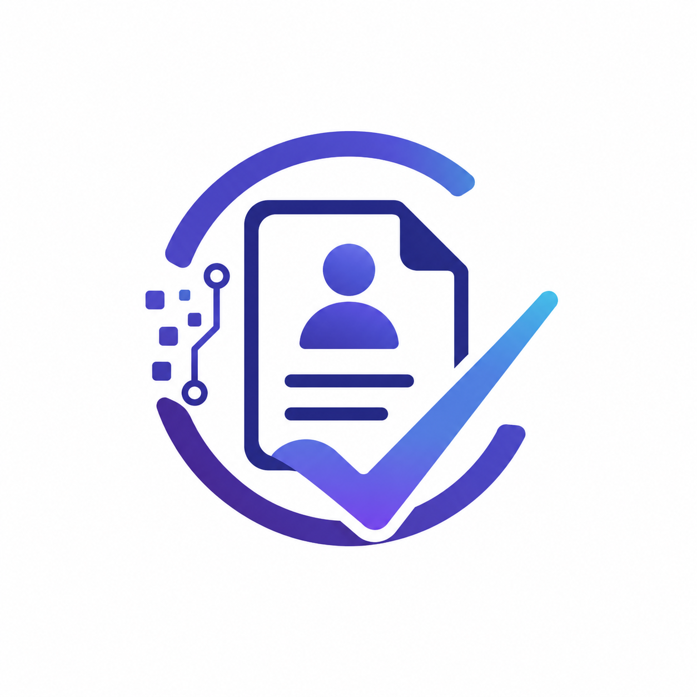

<p align="center">
  
</p>

<h1 align="center">🚀 CVision — AI-Powered CV Matching System</h1>

<p align="center">
  <strong>Sistem Rekrutmen Cerdas berbasis AI</strong> yang mencocokkan CV kandidat dengan lowongan pekerjaan menggunakan <em>TF-IDF</em>, <em>SBERT (Semantic Search)</em>, dan <em>Google Gemini AI</em>.
</p>

<p align="center">
  
  
  
  
  
  
  
</p>

---

## 📋 Daftar Isi

- [Tentang CVision](#-tentang-cvision)
- [Fitur Unggulan](#-fitur-unggulan)
- [Arsitektur Sistem](#-arsitektur-sistem)
- [Tech Stack](#-tech-stack)
- [Struktur Project](#-struktur-project)
- [Instalasi Lokal](#-instalasi-lokal)
- [Deployment ke Railway](#-deployment-ke-railway)
- [API Endpoints](#-api-endpoints)
- [Cara Penggunaan](#-cara-penggunaan)
- [Troubleshooting](#-troubleshooting)
- [Catatan Rilis & Perbaikan](#-catatan-rilis--perbaikan)

---

## 🎯 Tentang CVision

CVision adalah platform rekrutmen berbasis AI yang membantu HRD melakukan screening CV secara otomatis, cepat, dan objektif. Sistem menggabungkan **3 pendekatan AI** untuk memberikan hasil analisis yang akurat:

1. **TF-IDF** — Mencocokkan kata kunci antara CV dan Job Description
2. **SBERT** — Menganalisis kesamaan makna/kalimat secara semantik
3. **Gemini AI** — Memberikan rekomendasi pekerjaan dan analisis skill gap

### Masalah yang Diselesaikan

| Masalah | Solusi CVision |
|---------|----------------|
| Screening CV manual memakan waktu | AI otomatis memproses puluhan CV dalam hitungan menit |
| Subjektivitas penilaian HR | Skor objektif berbasis data (TF-IDF + SBERT) |
| Skill gap tidak terdeteksi | Analisis skill_present vs skill_missing dari Gemini AI |
| Rekomendasi pekerjaan bias | Rekomendasi AI berdasarkan isi CV sebenarnya |

---

## ✨ Fitur Unggulan

### Untuk HRD / Admin

| Fitur | Deskripsi |
|-------|-----------|
| 📋 **Job Listing Management** | Buat dan kelola posisi pekerjaan dengan deskripsi, skills, dan kualifikasi |
| 🎯 **Per-CV Screening** | Pilih CV spesifik untuk dianalisis — hemat token API |
| ⚡ **Batch Screening** | Proses semua CV sekaligus dengan jeda otomatis (rate limiting) |
| 📊 **Hybrid AI Scoring** | Skor kecocokan dari TF-IDF (50%) + SBERT (50%) |
| 🧩 **Skill Gap Analysis** | Identifikasi skill yang dimiliki vs yang kurang |
| 🤖 **Gemini Recommendations** | Rekomendasi 5 pekerjaan alternatif+ dari AI |
| 📈 **Candidate Ranking** | Urutan kandidat berdasarkan skor kecocokan |
| 📄 **Resume Generator** | Generate resume terstruktur dari teks CV |

### Untuk Pelamar

| Fitur | Deskripsi |
|-------|-----------|
| 📤 **Upload CV** | Upload CV dalam format PDF |
| 🔍 **Job Matching** | Lihat lowongan yang cocok dengan CV |
| 📊 **AI Analysis** | Dapatkan insight dari AI tentang kekuatan & kelemahan CV |

---

## 🏗️ Arsitektur Sistem

Sistem menggunakan arsitektur **Hybrid (Laravel + Python FastAPI)**:

```
┌─────────────────────────────────────────────────────────────┐
│                        Railway Platform                       │
│                                                               │
│  ┌─────────────────────────┐   ┌─────────────────────────┐   │
│  │     Laravel Service      │   │   Python AI Engine      │   │
│  │     (PHP 8.3 + Nginx)    │   │   (FastAPI + SBERT)    │   │
│  │                          │   │                         │   │
│  │  ┌───────────────────┐   │   │  ┌─────────────────┐   │   │
│  │  │ GeminiAIService   │───┼───┼─►│  /api/cv/analyze │   │   │
│  │  │ (HTTP Client)     │   │   │  └─────────────────┘   │   │
│  │  └───────────────────┘   │   │  ┌─────────────────┐   │   │
│  │  ┌───────────────────┐   │   │  │  TF-IDF         │   │   │
│  │  │ CVScoreService    │   │   │  │  SBERT          │   │   │
│  │  │ (Orchestrator)    │   │   │  │  Hybrid Score   │   │   │
│  │  └───────────────────┘   │   │  └─────────────────┘   │   │
│  └──────────┬────────────────┘   │  ┌─────────────────┐   │   │
│             │                     │  │  Gemini Client  │───┼───► Google Gemini API
│             ▼                     │  └─────────────────┘   │   │
│  ┌──────────────────────┐        └─────────────────────────┘   │
│  │   MySQL Database     │                                        │
│  │   (Railway Managed)  │                                        │
│  └──────────────────────┘                                        │
└─────────────────────────────────────────────────────────────────┘
```

### Alur Proses Screening CV

```
CV Upload (PDF)
    │
    ▼
┌─────────────────┐
│ PDF Extractor   │ ← PyMuPDF (fitz)
│ (extract_pdf)   │
└────────┬────────┘
         │ Teks CV
         ▼
┌─────────────────┐
│ Text Processor  │ ← lowercase, hapus simbol, hapus spasi ganda
│ (preprocess)    │
└────────┬────────┘
         │ Clean Text
         ▼
┌──────────────────────────────────────────────────────┐
│              SIMILARITY ENGINE (Python)               │
│  ┌────────────┐  ┌────────────┐  ┌────────────────┐  │
│  │  TF-IDF    │  │   SBERT    │  │   HYBRID       │  │
│  │  (sklearn) │  │(MiniLM-L6) │  │ 0.5*TF+0.5*SB  │  │
│  │  score 0-1 │  │  score 0-1 │  │  → percentage  │  │
│  └────────────┘  └────────────┘  └────────────────┘  │
└──────────────────────────────────────────────────────┘
         │
         ▼
┌──────────────────────────────────────────────────────┐
│              GEMINI AI (LLM)                          │
│  ┌────────────────────┐  ┌────────────────────────┐  │
│  │ Job Recommendations│  │   Skill Gap Analysis   │  │
│  │ → 5 rekomendasi    │  │ → skills_present[]     │  │
│  │ → confidence score │  │ → skills_missing[]     │  │
│  │ → reasoning        │  │ → fit_score            │  │
│  └────────────────────┘  │ → recommendation       │  │
│                          └────────────────────────┘  │
│  ┌────────────────────────────────────────────────┐  │
│  │ Resume Generator (Gemini)                      │  │
│  │ → Extract: nama, email, pengalaman, pendidikan │  │
│  │ → Format JSON terstruktur                      │  │
│  └────────────────────────────────────────────────┘  │
└──────────────────────────────────────────────────────┘
         │
         ▼
┌─────────────────┐
│  Save to DB     │ ← matching_results table
│  + Cache (1 jam)│ ← hindari panggilan AI berulang
└─────────────────┘
```

---

## 🛠️ Tech Stack

| Komponen | Teknologi |
|----------|-----------|
| **Web Framework** | Laravel 13 (PHP 8.3) |
| **AI Engine** | FastAPI (Python 3.11) |
| **Database** | MySQL 8.0 (via Railway) |
| **Frontend** | Blade + Tailwind CSS + Vite |
| **NLP / Similarity** | scikit-learn TfidfVectorizer, Sentence-Transformers (all-MiniLM-L6-v2) |
| **LLM** | Google Gemini 2.0 Flash Lite |
| **PDF Extraction** | PyMuPDF (fitz) |
| **Queue** | Laravel Database Queue |
| **Caching** | Database cache (1 jam TTL) |
| **Container** | Docker + Nginx + PHP-FPM |
| **Deployment** | Railway.app |

---

## 📁 Struktur Project

```
CVision/
│
├── 📂 app/                          # Laravel Application
│   ├── Http/Controllers/
│   │   ├── ScreeningController.php   # Per-CV & Batch screening
│   │   ├── JobListingController.php  # CRUD lowongan pekerjaan
│   │   ├── MatchingController.php    # Tampilkan hasil matching
│   │   ├── CandidateResumeController.php  # Detail kandidat
│   │   └── GoogleController.php      # Google OAuth login
│   ├── Services/
│   │   ├── AIService.php             # Interface AI Service
│   │   ├── GeminiAIService.php       # HTTP Client ke Python AI
│   │   ├── CVScoreService.php        # Orchestrator screening
│   │   └── CVExtractionService.php   # Ekstraksi teks PDF
│   ├── Jobs/
│   │   └── ProcessCVJob.php          # Queue job (retry 3x)
│   ├── Repositories/
│   │   └── MatchingResultRepository.php
│   └── Models/
│       ├── Cv.php
│       ├── UploadJob.php
│       └── MatchingResult.php
│
├── 📂 python/                       # Python AI Engine
│   ├── main.py                      # FastAPI server (endpoints)
│   ├── services/
│   │   ├── pdf_extractor.py         # PyMuPDF text extraction
│   │   ├── text_processor.py        # Regex extraction (exp, education)
│   │   ├── similarity.py            # TF-IDF + SBERT + Hybrid
│   │   └── gemini_client.py         # Gemini API client
│   ├── models/
│   │   └── schemas.py               # Pydantic schemas
│   └── requirements.txt
│
├── 📂 resources/views/              # Blade Templates
│   ├── components/                  # Navbar, sidebar, footer, topbar
│   └── pages/
│       ├── screening_cvs.blade.php
│       ├── matching_results.blade.php
│       └── candidate_resume.blade.php
│
├── Dockerfile                       # Docker build (Laravel + Nginx)
├── nginx.conf                       # Nginx production config
├── railway.json                     # Railway deployment config
└── .dockerignore                    # Docker ignore rules
```

---

## 💻 Instalasi Lokal

### Prasyarat

- PHP 8.1+
- Composer
- Node.js & NPM
- Python 3.10+
- MySQL
- Git

### 1. Clone & Setup Laravel

```bash
git clone https://github.com/chelseamaharani/CVision.git
cd CVision

# Install PHP dependencies
composer install

# Install Node dependencies
npm install

# Copy environment & generate key
cp .env.example .env
php artisan key:generate
```

### 2. Konfigurasi Database (.env)

```env
DB_CONNECTION=mysql
DB_HOST=127.0.0.1
DB_PORT=3306
DB_DATABASE=cvision
DB_USERNAME=root
DB_PASSWORD=

# AI Engine
AI_ENGINE_URL=http://127.0.0.1:8080
AI_ENGINE_TIMEOUT=120

# Gemini API (dapatkan di Google AI Studio)
GEMINI_API_KEY=your_gemini_api_key_here
```

```bash
# Run migrations
php artisan migrate

# Create storage link
php artisan storage:link
```

### 3. Setup Python AI Engine

```bash
cd python

# Buat virtual environment
python -m venv venv

# Aktivasi (Windows)
venv\Scripts\activate
# Aktivasi (Linux/Mac)
source venv/bin/activate

# Install dependencies
pip install -r requirements.txt

# Buat file .env untuk Python
echo "GEMINI_API_KEY=your_gemini_api_key_here" > .env
```

### 4. Jalankan Services

**Terminal 1 — Python AI Engine:**
```bash
cd python
uvicorn main:app --reload --port 8080
```

**Terminal 2 — Laravel Queue Worker:**
```bash
php artisan queue:work --tries=3
```

**Terminal 3 — Laravel Dev Server:**
```bash
php artisan serve
```

### 5. Akses Aplikasi

| URL | Keterangan |
|-----|------------|
| http://localhost:8000 | Laravel Web App |
| http://localhost:8080/docs | FastAPI Swagger Docs |
| http://localhost:8080/health | Health Check |

---

## ☁️ Deployment ke Railway

### Prasyarat Deployment

- Akun [Railway.app](https://railway.app) (Free $5/month)
- Repository GitHub terhubung

### Struktur Deployment

Proyek ini di-deploy sebagai **satu service Laravel** (PHP 8.3 + Nginx) dengan **MySQL database** terpisah. Python AI Engine bisa di-deploy sebagai service terpisah jika diperlukan.

### File Konfigurasi Deployment

| File | Fungsi |
|------|--------|
| `Dockerfile` | Build image Laravel + Nginx + PHP-FPM |
| `nginx.conf` | Konfigurasi Nginx production |
| `railway.json` | Konfigurasi Railway builder |
| `.dockerignore` | Optimasi Docker build |

### Environment Variables (Railway Dashboard)

| Variable | Value | Notes |
|----------|-------|-------|
| `APP_ENV` | `production` | Mode production |
| `APP_DEBUG` | `false` | Matikan debug |
| `APP_KEY` | `base64:...` | Generate via `php artisan key:generate --show` |
| `APP_URL` | `https://cvision.up.railway.app` | URL Railway |
| `DB_CONNECTION` | `mysql` | Dari Railway MySQL |
| `DB_HOST` | *(from Railway)* | Internal host |
| `DB_DATABASE` | `railway` | Default database |
| `DB_USERNAME` | *(from Railway)* | |
| `DB_PASSWORD` | *(from Railway)* | |
| `LOG_CHANNEL` | `stderr` | **Penting!** Log ke container stdout |
| `SESSION_DRIVER` | `database` | Session via database |
| `CACHE_STORE` | `database` | Cache via database |
| `GEMINI_API_KEY` | `your-key` | Google Gemini API Key |

### Deploy Langkah demi Langkah

1. Push ke GitHub:
```bash
git add .
git commit -m "Prepare for Railway deployment"
git push
```

2. Buka [Railway Dashboard](https://railway.app) → **New Project** → **Deploy from GitHub repo**

3. Railway akan otomatis mendeteksi `Dockerfile` dan build

4. Set environment variables di **Dashboard** → Project → Variables

5. Tambahkan **MySQL** service dari Railway Dashboard

6. Jalankan migration via **Railway Shell**:
```bash
php artisan migrate --force
```

---

## 🔌 API Endpoints

### FastAPI (Python AI Engine — Port 8080)

| Method | Endpoint | Deskripsi |
|--------|----------|-----------|
| `GET` | `/health` | Health check |
| `POST` | `/api/cv/analyze` | Analisis CV (upload PDF) |
| `POST` | `/api/cv/analyze-text` | Analisis CV (dari teks) |
| `POST` | `/api/cv/generate-resume` | Generate resume (dari PDF) |
| `POST` | `/api/cv/generate-resume-text` | Generate resume (dari teks) |

### Laravel Web Routes

| Method | URI | Controller | Deskripsi |
|--------|-----|------------|-----------|
| `GET` | `/dashboard` | DashboardController | Halaman utama admin |
| `GET/POST` | `/job_listing` | JobListingController | CRUD lowongan |
| `GET` | `/screening/{jobId}` | ScreeningController | Form screening per-CV |
| `POST` | `/screening/{cvId}/screen` | ScreeningController | Screen satu CV |
| `POST` | `/screening/{jobId}/screen-all` | ScreeningController | Screen semua CV |
| `GET` | `/matching_results` | MatchingController | Hasil matching |
| `GET` | `/candidate/{id}` | CandidateResumeController | Detail kandidat |
| `GET/POST` | `/auth/google` | GoogleController | Login Google OAuth |

---

## 📖 Cara Penggunaan

### 1. Login sebagai Admin/HRD

- Daftar akun baru atau login via Google
- Setelah login, akan masuk ke Dashboard

### 2. Buat Lowongan Pekerjaan

- Klik menu **Post Job** di sidebar
- Isi form: judul, deskripsi, skill yang dibutuhkan, kualifikasi
- Submit untuk menyimpan

### 3. Upload CV (oleh Pelamar)

- Pelamar daftar/login
- Upload CV dalam format PDF
- Sistem menyimpan dan siap di-screen

### 4. Screening CV

**Per-CV Screening (Rekomendasi):**
- Buka **Job Listing** → klik **Screen CVs**
- Centang CV yang ingin dianalisis
- Klik **Screen Selected CVs**
- Tunggu proses selesai (biasanya 5-10 detik per CV)

**Batch Screening:**
- Klik **Screen All CVs** untuk memproses semua sekaligus
- Sistem akan memproses dengan jeda 3 detik antar CV

### 5. Lihat Hasil

- Hasil screening ditampilkan di halaman **Matching Results**
- Setiap kandidat memiliki:
  - **Hybrid Score** (TF-IDF + SBERT)
  - **TF-IDF Score** (keyword matching)
  - **SBERT Score** (semantic similarity)
  - **Match Percentage** (gabungan)
  - **Skills Matched** & **Skill Gap**
  - **Job Recommendations** dari Gemini AI
  - **Ranking** berdasarkan skor

---

## 🔧 Troubleshooting

### Masalah Umum

| Masalah | Penyebab | Solusi |
|---------|----------|--------|
| **Logo tidak muncul** | File `Logo.png` (L besar) vs `logo.png` (l kecil) | ✅ **Sudah diperbaiki** — file di-rename ke `logo.png` |
| **Storage Permission Denied** | Ownership file storage milik root, bukan www-data | ✅ **Sudah diperbaiki** — Dockerfile sekarang pakai `su www-data` & hapus `|| true` |
| **Python AI Engine timeout** | SBERT model loading lama | Naikkan `AI_ENGINE_TIMEOUT` di .env (default 120 detik) |
| **Gemini API 503** | Rate limit / overload | Sistem sudah ada retry 3x + rate limiting 2 detik |

### Error: "The stream or file could not be opened in append mode"

**Penyebab:** File `storage/logs/laravel.log` tidak bisa ditulis oleh PHP-FPM (www-data).

**Solusi di Railway:**
1. Set `LOG_CHANNEL=stderr` di Railway Dashboard → Variables
2. Redeploy — log akan mengalir ke Railway Logs, bukan ke file

**Solusi di Dockerfile (sudah diterapkan):**
- Hapus `|| true` agar permission error terdeteksi
- Semua `artisan` commands di startup script menggunakan `su -s /bin/sh www-data -c "..."`

---

## 📝 Catatan Rilis & Perbaikan

### 🔧 Perbaikan 23 Juli 2026

#### 1. Logo Tidak Muncul di Railway (Case Sensitivity)

**Root Cause:** File `public/images/Logo.png` (L besar) tidak cocok dengan pemanggilan `asset('images/logo.png')` (l kecil) di Blade view. Windows case-insensitive, Linux case-sensitive.

**Perubahan:**
- ✅ Rename `Logo.png` → `logo.png`
- ✅ Update `topbar.blade.php` — ganti SVG placeholder dengan `` tag

#### 2. Storage Permission Denied

**Root Cause:**
- `|| true` di Dockerfile menutupi kegagalan `chown`/`chmod`
- `artisan` commands di startup script berjalan sebagai root, membuat file log milik root
- PHP-FPM (www-data) tidak bisa menulis ke file milik root

**Perubahan di Dockerfile:**
- Hapus `|| true` — build gagal jika permission setup error
- Tambah `chmod` eksplisit untuk `storage/logs`, `storage/framework`, `storage/app`
- Semua `artisan` commands pakai `su -s /bin/sh www-data -c "..."`

#### 3. Environment Variables

**Penting:** Set `LOG_CHANNEL=stderr` di Railway Dashboard agar log tidak perlu menulis ke file.

---

## 📄 Lisensi

Hak Cipta © 2026 CVision. Seluruh hak cipta dilindungi undang-undang.

---

## 👨‍💻 Pengembang

Dibangun dengan ❤️ oleh **Chelsea Maharani** — Politeknik Negeri Batam

---

<p align="center">
  <strong>CVision</strong> — <em>Deteksi & Analisis CV Cerdas dengan AI Secara Mandiri</em>
  <br>
  <a href="https://cvision.up.railway.app">🌐 Lihat Demo</a>
</p>